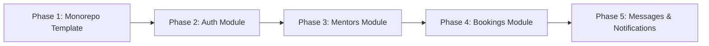

# Koach — Architecture Documentation & Implementation Plan

## 1. Current State Analysis

### Tech Stack
| Layer | Technology |
|---|---|
| Framework | Vite + React 18 (SPA) |
| Styling | Tailwind CSS |
| Router | React Router v7 |
| Backend-as-a-Service | Appwrite (cloud — `fra.cloud.appwrite.io`) |
| Animation | Framer Motion |
| Icons | Lucide React, React Icons |
| Auth | Appwrite Account (email/password + Google/LinkedIn OAuth) |

### Project Structure (Current)
```
koach/                          ← single repo, everything mixed
├── src/
│   ├── App.jsx                 ← 50+ route definitions
│   ├── pages/
│   │   ├── LoginPage.jsx
│   │   ├── SignUpPage.jsx
│   │   ├── MentorLogin.jsx
│   │   ├── MentorSignup.jsx
│   │   ├── MentorOnboardingPage.jsx
│   │   ├── listing-booking/
│   │   │   ├── Listing.jsx     ← ⚠️ HARDCODED mentor cards
│   │   │   └── Demo.jsx        ← ⚠️ HARDCODED single mentor profile + booking UI
│   │   ├── MenteeOnboard/      ← mentee onboarding multi-step (static)
│   │   └── MentorOnboarding/   ← mentor onboarding multi-step (saves to Appwrite)
│   ├── components/
│   │   ├── dashboard/          ← Mentee dashboard (Goals, Sessions, Mentors, Messages)
│   │   │                          ⚠️ ALL CONTENT IS HARDCODED/MOCK DATA
│   │   └── dashboard-mentor/   ← Mentor dashboard (Earnings, Mentees, Calendar)
│   │                              ⚠️ ALL CONTENT IS HARDCODED/MOCK DATA
│   ├── utils/
│   │   ├── appwrite.js         ← Appwrite client init, DB/Collection IDs
│   │   ├── auth.js             ← All auth functions (login, signup, OAuth, verify, reset)
│   │   ├── AuthContext.jsx     ← Global auth state, onboarding redirect logic
│   │   ├── featureFlags.js     ← Simple boolean feature flag system
│   │   └── database/
│   │       └── profiles.js     ← Appwrite DB CRUD for user_profiles collection
│   └── context/
│       ├── ModalContext.jsx
│       └── ToastContext.jsx
├── package.json                ← single package, all deps mixed
└── vite.config.js
```

### What Currently Uses Appwrite (Real Backend Calls)
| Feature | Appwrite Service | Collection |
|---|---|---|
| User signup | Account.create() | — |
| Email/password login | Account.createEmailPasswordSession() | — |
| Google/LinkedIn OAuth | Account.createOAuth2Session() | — |
| Email verification | Account.createVerification() | — |
| Password reset | Account.createRecovery() | — |
| Get current user | Account.get() | — |
| User profile (create/read/update) | Databases | `user_profile` DB → `user_profiles` collection |
| Onboarding progress save | Databases.updateDocument() | `user_profiles` |

### What is Currently HARDCODED / Static (Needs Backend)
| Feature | Current State | Target |
|---|---|---|
| Mentor listing (`/listing`) | Hardcoded JSX array of mentor cards | API → mentors collection |
| Single mentor profile (`/listing/jessica`) | Hardcoded demo page | API → mentor by ID |
| Mentee dashboard sessions | Mock data | API → bookings collection |
| Mentee dashboard mentors | Mock data | API → mentor connections |
| Mentor dashboard mentees | Mock data | API → bookings/mentees |
| Mentor dashboard earnings | Mock data | API → earnings records |
| Mentor dashboard calendar | Mock data | API → sessions/calendar |
| Messages | Mock data | API → messages collection |
| Booking flow | UI only, no DB write | API → create booking |

---

## 2. Target Architecture

### Goal
Split the single SPA into a **monorepo** with two sibling workspaces:
- `frontend/` — the Vite+React app (cleaned up, calls backend APIs)
- `backend/` — a Node.js + Express API server (module-based, calls Appwrite server-side)

### Why a Separate Backend?
- **Security**: Appwrite admin keys never exposed to the browser
- **Business logic**: Booking validation, mentor matching, payment hooks — all live in one place
- **Scalability**: Add new modules (payments, notifications, AI matching) without touching React
- **API contract**: Frontend and backend evolve independently

### Target Monorepo Structure
```
koach/                              ← root (monorepo)
├── package.json                    ← root scripts: "dev", "dev:frontend", "dev:backend"
├── .env.example                    ← shared env var reference
├── frontend/                       ← Vite + React (moved from current src/)
│   ├── package.json
│   ├── vite.config.js              ← proxy: /api → localhost:5000
│   ├── .env.example
│   └── src/
│       ├── App.jsx
│       ├── services/               ← NEW: API client layer (replaces direct Appwrite calls)
│       │   ├── api.js              ← axios instance with baseURL + auth interceptor
│       │   ├── authService.js      ← login, signup, logout → calls /api/auth/*
│       │   ├── mentorService.js    ← getMentors, getMentorById → calls /api/mentors/*
│       │   └── bookingService.js   ← createBooking, getBookings → calls /api/bookings/*
│       ├── utils/                  ← keep: AuthContext, featureFlags, ToastContext
│       ├── pages/
│       ├── components/
│       └── context/
└── backend/                        ← Node.js + Express API
    ├── package.json
    ├── .env.example
    └── src/
        ├── index.js                ← Express app entry point
        ├── config/
        │   └── appwrite.js         ← server-side Appwrite client (uses API key, not session)
        ├── middleware/
        │   ├── auth.js             ← JWT/session verification middleware
        │   └── errorHandler.js     ← global error handler
        └── modules/
            ├── auth/               ← Phase 2
            │   ├── auth.routes.js
            │   └── auth.controller.js
            ├── mentors/            ← Phase 3
            │   ├── mentors.routes.js
            │   └── mentors.controller.js
            ├── bookings/           ← Phase 4
            │   ├── bookings.routes.js
            │   └── bookings.controller.js
            └── (future: messages, notifications, payments)
```

### API Design (Frontend ↔ Backend)
```
Frontend (Vite :5173)  →  /api/* proxy  →  Backend (Express :5000)
                                              ↓
                                        Appwrite Cloud
                                      (server-side SDK + API key)
```

### Appwrite Collections to Create
| Collection | DB | Fields |
|---|---|---|
| `user_profiles` | `user_profile` | Already exists |
| `mentors` | `koach_db` | userId, name, title, bio, skills[], hourlyRate, availability, rating, reviewCount, isActive |
| `bookings` | `koach_db` | menteeId, mentorId, sessionDate, duration, status, notes, price |
| `reviews` | `koach_db` | bookingId, menteeId, mentorId, rating, comment, createdAt |
| `messages` | `koach_db` | senderId, receiverId, content, isRead, conversationId, createdAt |

---

## 3. Phased Implementation Plan

> **Approach**: One phase at a time. Each phase is independently testable and deployable. The app works at every phase.

---

### Phase 1 — Monorepo Template (FIRST PRIORITY)

**Goal**: Create the production-ready project structure. No feature changes — just reorganize and add the backend scaffold.

**Changes**:
- Move all current `koach/` code into `koach/frontend/`
- Create `koach/backend/` with Express server skeleton
- Add root [package.json](file:///c:/Users/shaws/OneDrive/Desktop/koach/package.json) with `concurrently` to run both
- Add Vite proxy so `frontend` `/api/*` calls route to `backend :5000`
- Both apps start with a single `npm run dev` from root

**Deliverable**: `npm run dev` starts both frontend (unchanged behavior) and a working Express server at `:5000` with a health check endpoint `GET /api/health`.

---

### Phase 2 — Auth Module (Backend)

**Goal**: Move auth from direct Appwrite SDK calls (client-side) to proxied backend calls.

**Backend**:
- `POST /api/auth/login` → calls Appwrite, returns session token
- `POST /api/auth/signup` → creates account + user_profile document
- `POST /api/auth/logout` → deletes session
- `GET /api/auth/me` → returns current user + profile
- `POST /api/auth/verify` → sends verification email
- `POST /api/auth/forgot-password` → triggers recovery
- `GET /api/auth/oauth/:provider` → OAuth initiation

**Frontend**:
- Replace [utils/auth.js](file:///c:/Users/shaws/OneDrive/Desktop/koach/src/utils/auth.js) direct Appwrite calls with `services/authService.js` → `/api/auth/*`
- `AuthContext` updated to use new service layer

**Why**: Appwrite credentials stay on the server. Frontend never touches Appwrite SDK directly.

---

### Phase 3 — Mentors Module (Backend)

**Goal**: Replace hardcoded mentor listing with real data from Appwrite.

**Backend**:
- `GET /api/mentors` → list all active mentors (with filters: skill, price, rating)
- `GET /api/mentors/:id` → single mentor profile
- `POST /api/mentors` → create mentor profile (mentor onboarding completion)
- `PATCH /api/mentors/:id` → update mentor profile

**Frontend**:
- [Listing.jsx](file:///c:/Users/shaws/OneDrive/Desktop/koach/src/pages/listing-booking/Listing.jsx) — fetch from `GET /api/mentors` instead of hardcoded array
- [Demo.jsx](file:///c:/Users/shaws/OneDrive/Desktop/koach/src/pages/listing-booking/Demo.jsx) — fetch from `GET /api/mentors/:id` instead of hardcoded profile
- Create `services/mentorService.js`

**Appwrite**: Create `mentors` collection in Appwrite with proper attributes.

---

### Phase 4 — Bookings Module (Backend)

**Goal**: Make the booking flow write to the database and power the dashboards.

**Backend**:
- `POST /api/bookings` → create a booking
- `GET /api/bookings/mentee/:menteeId` → all bookings for a mentee
- `GET /api/bookings/mentor/:mentorId` → all bookings for a mentor
- `PATCH /api/bookings/:id` → update status (confirm/cancel)

**Frontend**:
- [Demo.jsx](file:///c:/Users/shaws/OneDrive/Desktop/koach/src/pages/listing-booking/Demo.jsx) booking form → calls `POST /api/bookings`
- Mentee [Sessions.jsx](file:///c:/Users/shaws/OneDrive/Desktop/koach/src/components/dashboard/Sessions.jsx) → fetch from `GET /api/bookings/mentee/:menteeId`
- Mentor [Mentees.jsx](file:///c:/Users/shaws/OneDrive/Desktop/koach/src/components/dashboard-mentor/Mentees.jsx) → fetch from `GET /api/bookings/mentor/:mentorId`
- Create `services/bookingService.js`

---

### Phase 5 — Messages & Notifications (Future)

- Real-time messaging via Appwrite Realtime
- Email notifications (SendGrid) triggered server-side on booking events
- Push notifications scaffold

---

## 4. Verification Plan

### Phase 1 (Template)
```bash
# From project root:
npm run dev
# Expected: frontend at http://localhost:5173 (all existing pages work)
# Expected: backend health at http://localhost:5000/api/health → { status: "ok" }
```

### Phase 2 (Auth)
```bash
# Manual: go to /login, login with existing account → should work
# Manual: go to /signup, create new account → should work
# Backend: curl http://localhost:5000/api/auth/me (with cookie) → user object
```

### Phase 3 (Mentors)
```bash
# Manual: go to /listing → should show real mentors from DB (not hardcoded)
# Backend: curl http://localhost:5000/api/mentors → JSON array of mentors
```

### Phase 4 (Bookings)
```bash
# Manual: complete booking flow on /listing/:id → check Appwrite console for new booking document
# Manual: check mentee dashboard Sessions tab → should show real bookings
```

---

## 5. Environment Variables

### `frontend/.env.example`
```env
VITE_API_BASE_URL=http://localhost:5000
# No Appwrite keys needed — all calls go through backend
```

### `backend/.env.example`
```env
PORT=5000
APPWRITE_ENDPOINT=https://fra.cloud.appwrite.io/v1
APPWRITE_PROJECT_ID=68d6e7520021a096d289
APPWRITE_API_KEY=your_appwrite_server_api_key_here
DATABASE_ID=koach_db
JWT_SECRET=your_jwt_secret_here
FRONTEND_URL=http://localhost:5173
```

> [!IMPORTANT]
> The `APPWRITE_API_KEY` is a **server-side** API key generated from the Appwrite console. Never expose it in the frontend [.env](file:///c:/Users/shaws/OneDrive/Desktop/koach/.env).

---

## 6. Summary: Phase Execution Order



Each phase is a **git commit / PR** that keeps the app fully functional. No big bang rewrites.
